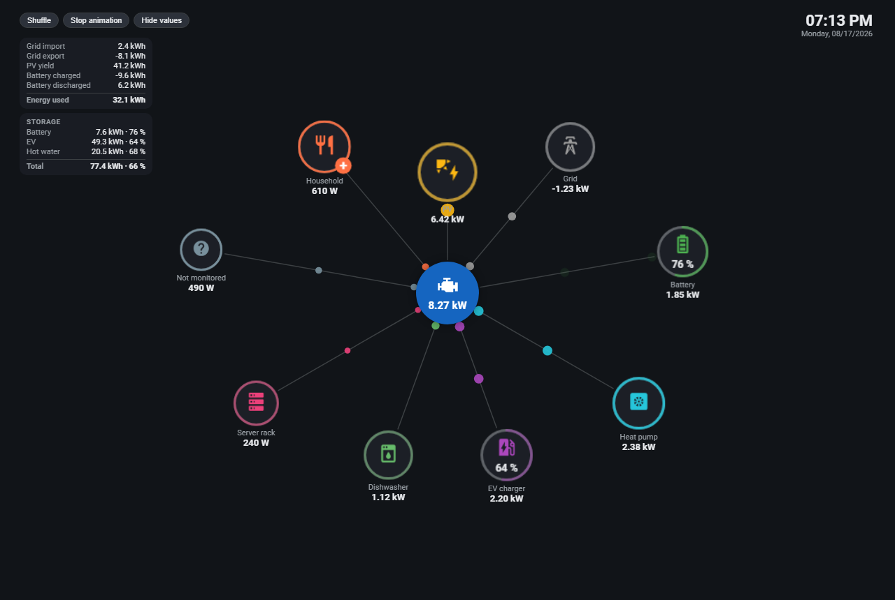
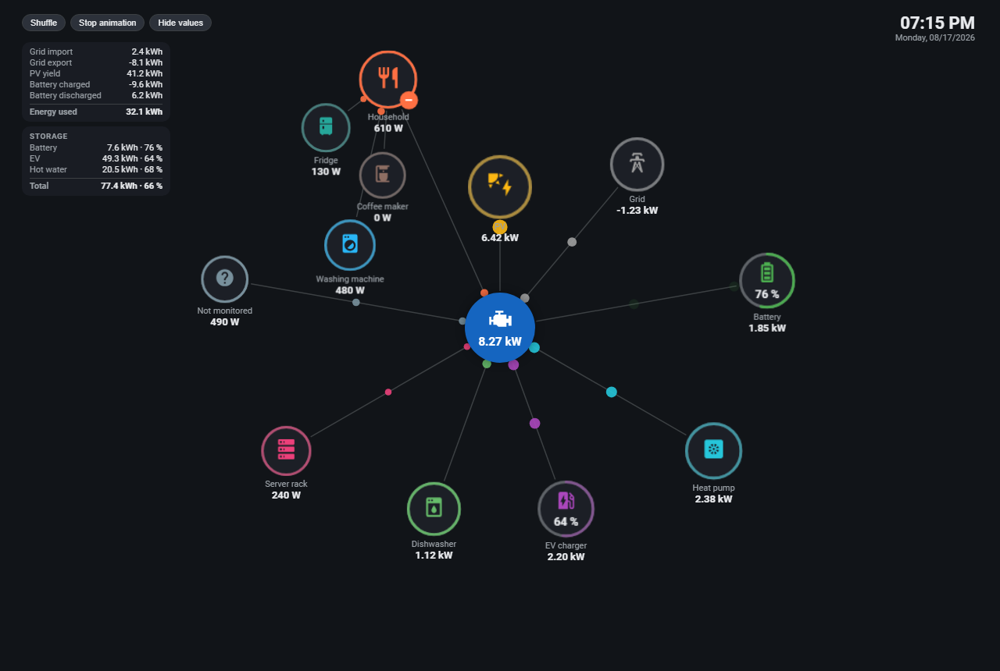
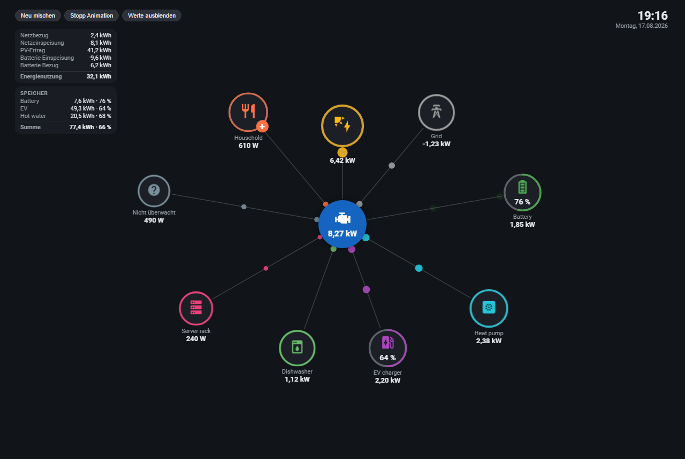

# Dynamic EnergyCard

An animated, physics-based live energy-flow card for Home Assistant.

Sources (PV, grid, battery) orbit the inner ring, consumers the outer ring.
Every circle grows and pulses with its live power, flow dots stream along the
links, and a custom force simulation keeps everything collision-free — even
with 40+ devices. One file, no build step, no dependencies.

[](docs/Dynamic%20Energy%20Card%20Video.mp4)

▶ **[Watch the demo video](docs/Dynamic%20Energy%20Card%20Video.mp4)** – the live animation,
groups, drag & drop and the motion features in action.

## Features

- **Live force layout** – sources inside, consumers outside, collision-free,
  smoothly animated (fixed 60 Hz physics with render interpolation). The
  simulation goes to sleep when nothing moves: ~0 % CPU when idle.
- **Power-driven visuals** – circle size (up to 2.5×) and pulse frequency
  (0.5–10 Hz, log scale) follow the live power of each device.
- **Auto roles** – bidirectional sensors (battery, grid) switch sides
  automatically with hysteresis: positive = source, negative = consumer.
  Exports/charging are displayed as negative numbers, consumption is always positive.
- **Groups** – collapse many devices into one circle (sum of members); tap to
  expand them into a fan. Flow dots keep the group color along the chain.
- **Fill rings** – show a state of charge or a temperature as a partial ring
  (e.g. battery SoC, boiler 20–80 °C), with a value inside the circle.
- **Centre circle** – shows the sum of all currently active sources
  (grid import + PV + battery discharge), or any entity you configure.
- **Daily energy panel** – grid import/export, PV yield, battery
  charge/discharge and the computed total consumption, exports shown negative.
- **Storage panel** – battery, EVs and thermal storage in kWh and %, including
  temperature-to-energy mapping for hot-water tanks and a grand total.
- **"Not monitored" circle** – a virtual consumer showing what your meters
  don't cover: sum of sources minus all known consumers.
- **Touch & motion** – drag a circle to pin it anywhere, shake your phone to
  shuffle, tilt the device and the circles slowly fall in that direction.
- **Toggles & popups** – tap a switchable device to toggle it; hover or
  long-press for a popup with power, energy and extra entities.
- **Visual editor** – full config UI with unit-filtered entity pickers
  (only kWh sensors for energy fields, only W/kW for power fields …), an
  Energy-dashboard import and a bulk picker for new power entities.
- **English & German** – follows your Home Assistant profile language,
  overridable per card. PRs for more languages are welcome.
- **Demo mode** – try everything without a single sensor (`demo: true`),
  including scenario buttons (PV drop, battery flip, 20 kW peak …).

Expanded group and German UI:





## Mobile, motion & wall displays

The card is built to be touched:

- **Tap** a circle for its popup (or to toggle a switchable device),
  **long-press** for the popup on touch devices, **drag** a circle anywhere to
  pin it (dashed ring); *Shuffle* releases all pins.
- **Shake to shuffle** – shake your phone and the circles rearrange
  (`devicemotion`, with debouncing so a bump on the table doesn't trigger it).
- **Tilt gravity** – tilt the device left/right/up/down and the circles slowly
  fall in that direction, then spring back to their rings when you level the
  device again. The neutral position is learned from how you hold the phone,
  so normal handling doesn't move anything. On iOS the card asks for the
  motion permission on your first tap.
- **Wall panels** – the card works excellently on wall-mounted dashboards; it
  is in daily use on a **Shelly Wall Display**. The physics engine sleeps
  whenever the layout is at rest, so an idle card costs almost no CPU — ideal
  for an always-on display. Combined with the clock and the *Hide values*
  button it makes a clean full-screen energy panel (`options.height: max`).

## Installation

### HACS (recommended)

1. HACS → three-dot menu → **Custom repositories**
2. Add `https://github.com/badboiaustria/dynamic-energy-card` as type **Dashboard**
3. Search for **Dynamic EnergyCard**, install, and reload your browser

### Manual

1. Download `dynamic-energy-card.js` from the latest release
2. Copy it to `config/www/`
3. Add a dashboard resource: URL `/local/dynamic-energy-card.js`, type **Module**

## Quick start

The card works out of the box in demo mode:

```yaml
type: custom:dynamic-energy-card
demo: true
```

A minimal live setup:

```yaml
type: custom:dynamic-energy-card
nodes:
  - id: pv
    name: PV
    icon: mdi:solar-power
    color: '#FDB813'
    power_entity: sensor.pv_power
    role: source
  - id: grid
    name: Grid
    icon: mdi:transmission-tower
    color: '#9E9E9E'
    power_entity: sensor.grid_net_power   # + = import, − = export
    role: auto
  - id: dishwasher
    name: Dishwasher
    icon: mdi:dishwasher
    power_entity: sensor.dishwasher_power
```

Or open the visual editor and click **Import from Energy dashboard** — the card
builds its node list from your existing Energy configuration.

## Configuration

### Top level

| Option | Type | Default | Description |
|---|---|---|---|
| `type` | string | — | `custom:dynamic-energy-card` |
| `language` | string | HA profile | UI language, `en` or `de` |
| `demo` | bool | `false` | Simulation mode with scenario buttons |
| `inverter` | object | — | Centre circle, see below |
| `options` | object | — | Tuning options, see below |
| `stats` | object | — | Daily energy panel, see below |
| `storage` | object | — | Storage panel, see below |
| `residual` | object/bool | off | "Not monitored" circle, see below |
| `groups` | list | `[]` | Group definitions |
| `nodes` | list | `[]` | Device definitions |

### `inverter` (centre circle)

| Option | Type | Default | Description |
|---|---|---|---|
| `name` | string | *Inverter* | Tooltip name |
| `icon` | string | `mdi:engine` | MDI icon |
| `color` | string | `#1565C0` | Fill color |
| `size` | number | `90` | Diameter in px |
| `power_entity` | entity | — | Shown in the centre; empty = sum of all active sources |

### `options`

| Option | Type | Default | Description |
|---|---|---|---|
| `max_power` | number | `20000` | W at which circles reach max size and pulse |
| `min_circle_px` | number | `60` | Circle diameter at 0 W |
| `size_max_factor` | number | `2.5` | Max size multiplier |
| `pulse_hz_min` / `pulse_hz_max` | number | `0.5` / `10` | Pulse frequency range (log-interpolated) |
| `visual_pulse_cap_hz` | number | `3` | Visible pulse cap (0 = uncapped); above it the pulse deepens instead |
| `dots_max` | number | `60` | Global flow-dot budget |
| `zero_threshold_w` | number | `25` | Dead zone: below this a device counts as 0 W |
| `density` | number | `1.0` | Layout density, 0.5 loose … 2 tight |
| `width` / `height` | number/`max` | auto | Card size in px, `max` = full viewport height |
| `show_controls` | bool | `true` | Shuffle / stop / hide-values buttons |
| `show_clock` | bool | `true` | Clock with date, top right |

### `stats` (daily energy panel)

All fields take kWh sensors (e.g. daily utility meters). Exports are displayed
negative; the total row is the computed consumption of the whole home.

| Option | Description |
|---|---|
| `show` | `false` hides the panel |
| `grid_import` / `grid_export` | Daily grid energy |
| `pv` | Daily PV yield |
| `battery_in` / `battery_out` | Daily battery charge/discharge |

### `storage` (storage panel)

```yaml
storage:
  items:
    - name: Battery
      soc_entity: sensor.battery_soc            # % directly
      capacity_entity: sensor.battery_capacity  # Wh, kJ, MJ or kWh – auto-converted
    - name: Hot water
      temp_entity: sensor.boiler_temperature    # temperature mapping
      temp_min: 20                              # °C = 0 %
      temp_max: 80                              # °C = 100 %
      capacity_kwh: 30                          # kWh at 100 %
```

Each row shows `kWh · %`; a total row sums the energy and relates it to the
total capacity. `capacity_kwh` (number) wins over `capacity_entity`.

### `residual` ("Not monitored" circle)

```yaml
residual:
  show: true
  name: Not monitored   # optional
  icon: mdi:help-circle # optional
  color: '#78909C'      # optional
```

A virtual consumer with `sources − known consumers` (never negative). Grid
export and battery charging count as known consumption.

### `nodes`

| Option | Type | Description |
|---|---|---|
| `id` | string | Unique id (required) |
| `name` | string | Display name |
| `icon` / `color` | string | MDI icon and color |
| `power_entity` | entity | Power sensor (W or kW; auto-converted) |
| `power_entities` | list | Multiple sensors, summed |
| `role` | string | `consumer` (default), `source`, or `auto` (+ = source) |
| `invert` | bool | Flip the sign of the power reading |
| `group` | string | Id of the group this device belongs to |
| `ring` | `fill` | Fill ring instead of pulse ring |
| `fill_entity` / `fill_min` / `fill_max` | entity/number | Value and range for the fill ring |
| `inner_text_entity` / `inner_text_unit` / `inner_text_scale` / `inner_text_attribute` | — | Value shown inside the circle |
| `inner_text` | string | Static text inside the circle |
| `toggle_entity` | entity | Tap toggles this entity; fill shows on/off |
| `energy_entity` | entity | Shown in the popup |
| `extra_entities` | list | Up to 2 extra popup rows |
| `area` | string | Subtitle in the popup |

### `groups`

| Option | Type | Description |
|---|---|---|
| `id` / `name` / `icon` / `color` | — | Like nodes |
| `power_entities` | list | Optional; without it the group shows the sum of its members |
| `role` | string | Optional; sum groups default to `auto` |

## Sign convention

- Consumers always show **positive** numbers.
- `auto` devices (grid, battery) show a **minus** when energy leaves the house:
  grid export and battery charging are negative, grid import and battery
  discharge are positive.
- The centre circle is the sum of all currently active **sources**.

## Performance notes

The card renders with `transform`/`opacity` only (compositor-friendly), throttles
text updates, pools DOM nodes and puts the physics to sleep when the layout is
at rest — an idle card costs practically no CPU. Off-screen or hidden tabs stop
the animation loop entirely.

## Contributing

Issues and PRs are welcome — especially new translations: add a block to the
`TRANSLATIONS` table at the top of `dynamic-energy-card.js`.

## License

[GPL-3.0](LICENSE) © Michael Böhm
